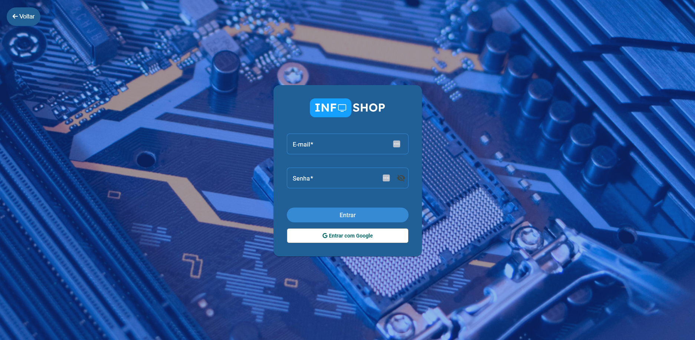
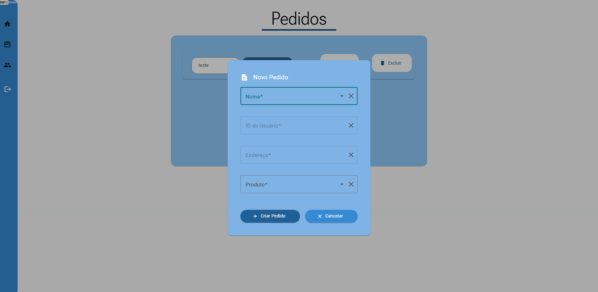

# 🛍️ Info-Shop


[](LICENSE)

**Info-Shop** é uma aplicação web construída com **Angular (v19.1.8)** e **Supabase** que simula um **e-commerce de produtos de informática**.  
Os usuários podem navegar por categorias, visualizar detalhes.

---

## 🚀 Tecnologias

- **Frontend**: Angular 19.1.8  
- **Backend**: Supabase (autenticação e banco de dados)  
- **Gerenciador de pacotes**: npm  
- **Editor**: VS Code (configurações já inclusas)  
- **Deploy**: Netlify  
- **Linguagens**:
  - TypeScript (~53.5%)
  - SCSS (~26.1%)
  - HTML (~20.3%)
  - JavaScript (~0.1%)

---

## 📦 Instalação e Execução

1. Faça o clone do repositório:
    ```bash
    git clone https://github.com/Gust4v0Di4sC/Info-Shop.git
    cd Info-Shop
    ```
2. Instale as dependências:
    ```bash
    npm install
    ```
3. Configure o **Supabase**:  
   - Crie um projeto no [Supabase](https://supabase.com/).  
   - Configure as variáveis de ambiente (`SUPABASE_URL`, `SUPABASE_KEY`) no projeto Angular.  
   - Certifique-se de que as tabelas/estruturas necessárias estão configuradas no banco.  

4. Execute o servidor de desenvolvimento:
    ```bash
    ng serve
    ```
5. Acesse no navegador:
    ```
    http://localhost:4200
    ```

---

## 🖼️ Funcionalidades Principais

- Navegação por **categorias de produtos** de informática.  
- **Página de detalhes** para cada produto.   
- Integração com **Supabase** para gerenciamento de dados.  
- Deploy automatizado no **Netlify**.  

---

## 📂 Estrutura do Projeto

````

Info-Shop/
│── src/               # Código-fonte principal (componentes, services, etc.)
│── public/            # Arquivos estáticos públicos
│── .vscode/           # Configs do VS Code (recomendadas)
│── angular.json       # Configuração do Angular CLI
│── package.json       # Dependências & scripts do projeto
│── README.md          # Documentação

````

---

## 📸 Screenshot (placeholder)

* Landing Page


* Tela de Login



* Tela de pedidos



> **Substitua** o link acima por uma screenshot real rodando seu projeto após criar/push da imagem no repositório.

---

## 🤝 Como Contribuir

1. Faça um fork deste repositório.  
2. Crie uma branch para sua alteração:
    ```bash
    git checkout -b feature/minha-feature
    ```
3. Realize suas mudanças e commit:
    ```bash
    git commit -am "Adiciona minha feature"
    ```
4. Envie para sua branch:
    ```bash
    git push origin feature/minha-feature
    ```
5. Abra um Pull Request para revisão.  

---

## 📜 Licença

Este projeto está sob a licença **MIT**. Veja o arquivo [LICENSE](LICENSE) para mais detalhes.  

---

## ℹ️ Sobre

Info-Shop simula um e-commerce de produtos de informática, construído com **Angular + Supabase** para uma experiência navegável, moderna e com backend integrado, e publicado no **Netlify**.  
