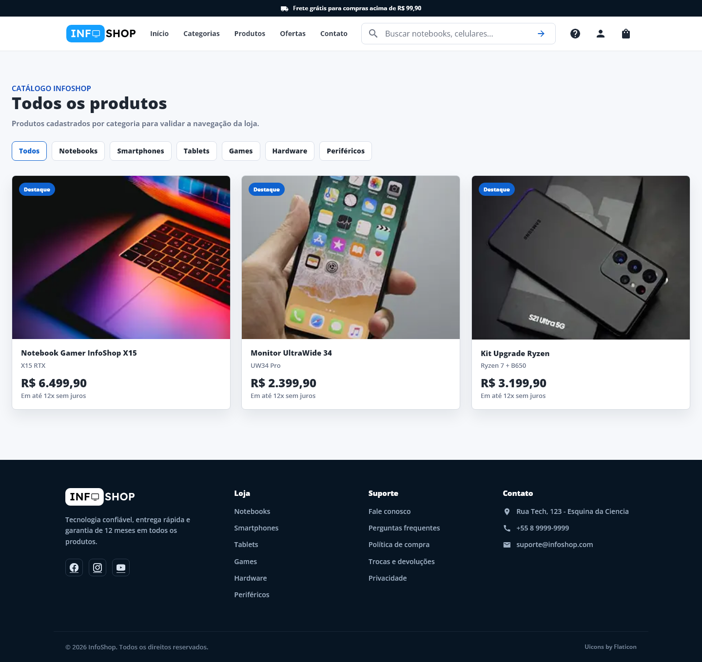
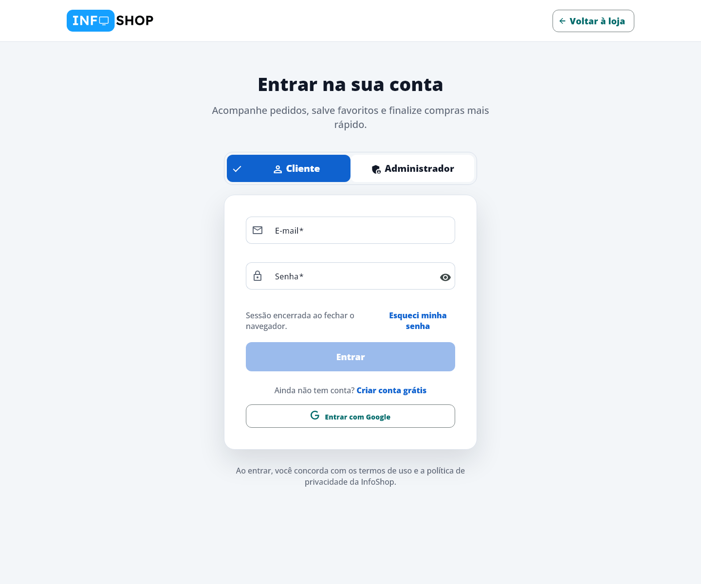
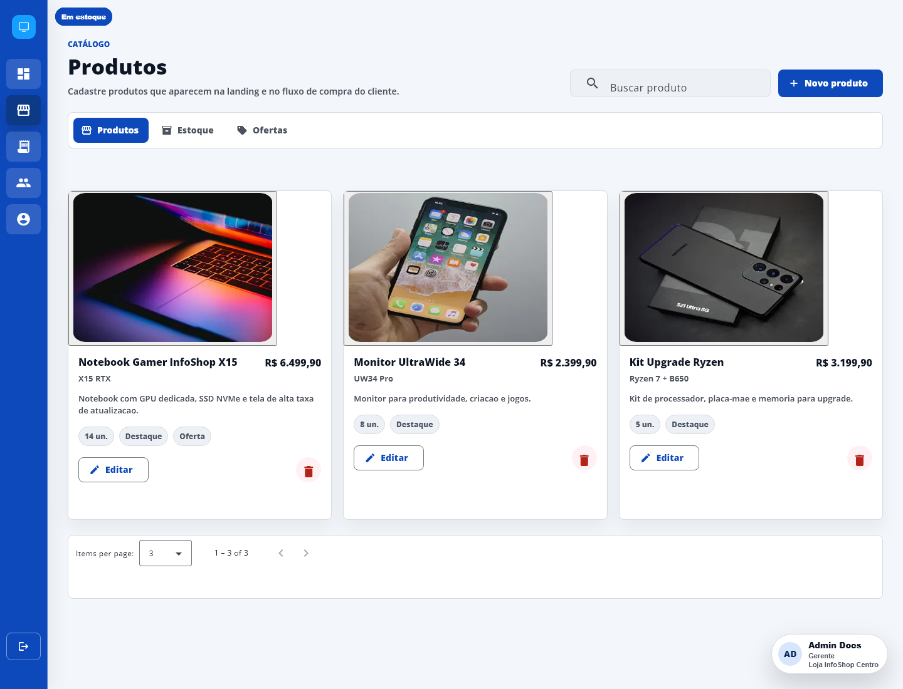

# Info-Shop

Info-Shop é uma aplicação web de e-commerce para produtos de informática. O projeto combina loja pública, autenticação de clientes, carrinho, checkout, acompanhamento de entregas e um painel administrativo com controle de produtos, estoque, pedidos, clientes, ofertas e personalização visual.

## Stack

- Angular 20.3 com componentes standalone, lazy loading, SSR, hydration e Service Worker.
- TypeScript 5.9, SCSS, RxJS, Angular Material/CDK e Bootstrap.
- Supabase para Auth, Postgres, Storage, RLS, RPCs, migrations e Edge Functions.
- Express 5 como BFF same-origin para autenticação, cookies HttpOnly, headers de segurança e proxy Supabase.
- Netlify para build, funções serverless e deploy.
- Mercado Pago para pagamento.
- Melhor Envio para cotação, autorização, checkout e webhooks de entrega.
- Gemini para comparador de hardware com IA.
- Sentry para observabilidade, tracing, replay e sourcemaps.
- Playwright para testes E2E.

## Arquitetura

O frontend Angular é dividido por áreas de negócio em `src/app/features`:

- `public`: landing page, catálogo, detalhe do produto, carrinho, perfil do cliente, entregas, retorno de pagamento, suporte e páginas de erro.
- `auth`: login, cadastro, recuperação de senha, nova senha e callback OAuth/PKCE.
- `admin`: shell administrativo, dashboard, produtos, estoque, pedidos, entregas, ofertas, clientes, perfil e personalização.

O núcleo compartilhado fica em `src/app/core`:

- `auth`: sessão do usuário e guards.
- `supabase`: client tipado, parser de respostas e proxy de chamadas REST/Storage/Functions.
- `tenant`: contexto da loja administrativa selecionada.
- `theme`: tema e logo por administrador/loja.
- `observability`: request id e interceptor de telemetria.
- `layout`: serviços responsivos para shell e dialogs.

O backend Node/Express fica em `src/api-app.ts` e é reaproveitado por:

- `src/server.local.ts`: SSR local com Express e Angular Node App Engine.
- `src/server.ts`: SSR no Netlify Angular Runtime, encaminhando `/api/*` para `/.netlify/functions/api/*`.
- `netlify/functions/api.ts`: função Netlify empacotada com `serverless-http`.

As Edge Functions em `supabase/functions` concentram integrações sensíveis com Mercado Pago, Melhor Envio, Gemini e newsletter. Segredos como `SUPABASE_SERVICE_ROLE_KEY`, tokens de provedores e chaves de IA devem ficar apenas no ambiente das funções.

## Estrutura Atual

```text
info-shop/
|-- src/
|   |-- app/
|   |   |-- core/                 # Auth, Supabase, tenant, tema, layout e observabilidade
|   |   |-- features/             # Áreas public, auth e admin
|   |   |-- models/               # Tipos de domínio baseados no schema Supabase
|   |   |-- services/             # Serviços de aplicação e acesso a dados
|   |   |-- shared/               # Material module, pipes, diretivas, dialogs e utils
|   |-- api-app.ts                # BFF Express compartilhado
|   |-- server.ts                 # Handler SSR para Netlify
|   |-- server.local.ts           # Handler SSR local
|   |-- main.ts / main.server.ts  # Entradas browser e server
|-- supabase/
|   |-- migrations/               # Schema, RLS, seeds, índices e funções SQL
|   |-- functions/                # Edge Functions e helpers compartilhados
|-- netlify/functions/api.ts      # Adaptador serverless do BFF
|-- e2e/                          # Testes Playwright
|-- docs/                         # Documentação detalhada do projeto
|-- public/                       # Assets públicos, ícones, logos e redirects/headers
|-- scripts/                      # Automação de sourcemaps Sentry
|-- angular.json                  # Build Angular SSR/PWA
|-- ngsw-config.json              # Cache do Service Worker
|-- netlify.toml                  # Build/deploy Netlify
|-- set.env                       # Geração dos environments Angular
|-- package.json                  # Scripts e dependências
```

## Capturas Internas

As capturas abaixo foram geradas a partir do SSR local com dados mockados para documentação visual.

### Landing page


### Catálogo



### Login



### Administração de produtos



## Requisitos

- Node.js `>=22.22.0`, conforme `package.json`.
- npm.
- Supabase CLI para ambiente local de banco e Edge Functions.
- Conta/projeto Supabase configurado.
- Variáveis públicas de frontend: `SUPABASE_URL` e `SUPABASE_ANON_KEY` ou `SUPABASE_KEY`.

## Execução Local

Instale as dependências:

```bash
npm install
```

Configure `.env.local`:

```env
SUPABASE_URL=https://your-project-ref.supabase.co
SUPABASE_KEY=your-anon-public-key
```

Rode o SSR local:

```bash
npm run dev
```

Por padrão, o servidor local usa `http://localhost:4300`, a menos que `PORT` ou `LOCAL_DEV_PORT` seja definido.

Para rodar somente o servidor de desenvolvimento SPA:

```bash
npm run start:spa
```

## Scripts Úteis

```bash
npm run build                 # build de produção Angular
npm run build:observability   # build + upload de sourcemaps Sentry
npm run typecheck:netlify     # typecheck das funções Netlify
npm run test                  # testes unitários Karma/Jasmine
npm run e2e                   # testes Playwright
npm run supabase:start        # sobe Supabase local
npm run supabase:db:reset     # reaplica migrations localmente
npm run supabase:types:local  # regenera tipos a partir do Supabase local
```

## Segurança e Variáveis

O browser não recebe tokens de sessão Supabase. A autenticação passa pelo BFF em `/api/auth/*`, que grava cookies `HttpOnly`, `SameSite=Lax` e `Secure` em produção. Chamadas REST, Storage e Edge Functions do Supabase saem do navegador por `/api/supabase/*`; o servidor injeta o JWT da sessão ou a anon key.

Nunca coloque `SUPABASE_SERVICE_ROLE_KEY` no Angular, em `src/environments/*`, em `.env.local` destinado ao build ou em qualquer arquivo servido ao navegador. Esse segredo pertence apenas às Edge Functions.

## Documentação

A documentação detalhada está em [docs/index.md](docs/index.md):

- [Visão geral](docs/overview.md)
- [Arquitetura](docs/architecture.md)
- [Frontend Angular](docs/frontend.md)
- [Backend e API](docs/backend-api.md)
- [Banco de dados e Supabase](docs/database.md)
- [Integrações](docs/integrations.md)
- [Segurança](docs/security.md)
- [Testes](docs/testing.md)
- [Deploy e operação](docs/deployment.md)
- [Observabilidade](docs/observability.md)
