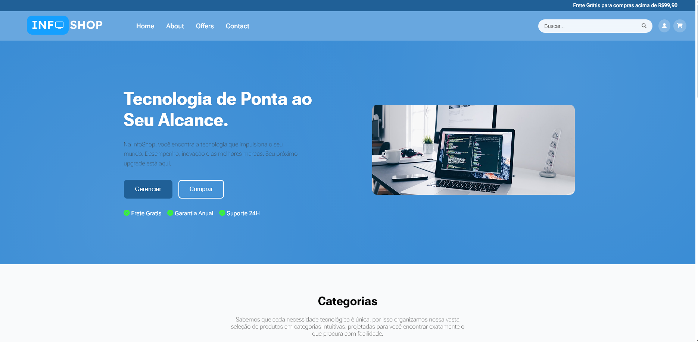
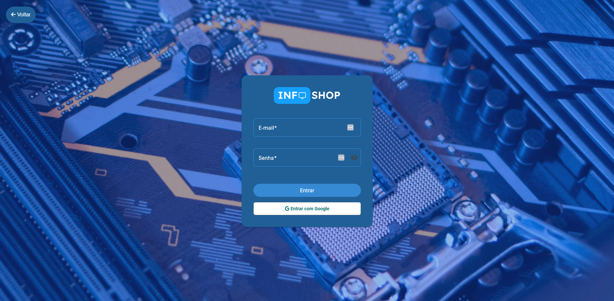
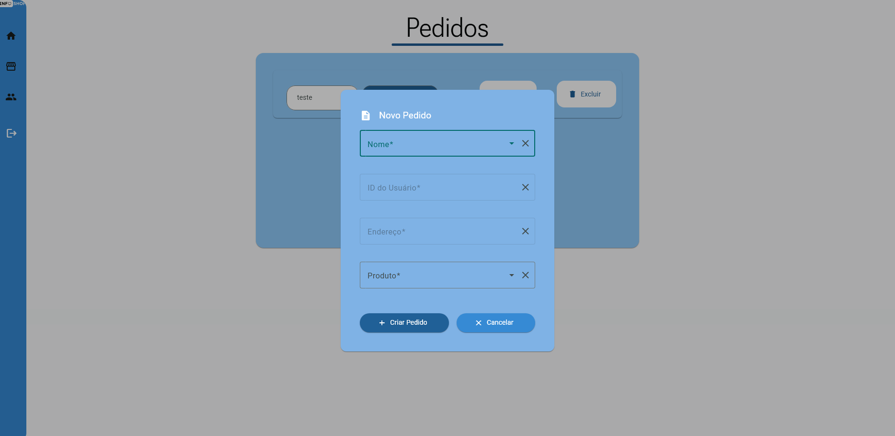

# 🛍️ Info-Shop


[](LICENSE)

**Info-Shop** é uma aplicação web construída com **Angular 20** e **Supabase** que simula um **e-commerce de produtos de informática**.
Os usuários podem navegar por categorias, visualizar detalhes.

---

## 🚀 Tecnologias

- **Frontend**: Angular 20
- **Backend**: Supabase (autenticação e banco de dados)  
- **Gerenciador de pacotes**: npm  
- **Editor**: VS Code (configurações já inclusas)  
- **Deploy**: Netlify  
- **Linguagens**:
  - TypeScript (~53.5%)
  - SCSS (~26.1%)
  - HTML (~20.3%)
  - JavaScript (~0.1%)

---

## 📦 Instalação e Execução

1. Faça o clone do repositório:
    ```bash
    git clone https://github.com/Gust4v0Di4sC/Info-Shop.git
    cd Info-Shop
    ```
2. Instale as dependências:
    ```bash
    npm install
    ```
3. Configure o **Supabase**:  
   - Crie um projeto no [Supabase](https://supabase.com/).  
   - Configure as variáveis de ambiente públicas do Angular (`SUPABASE_URL`, `SUPABASE_ANON_KEY`).
   - Certifique-se de que as tabelas/estruturas necessárias estão configuradas no banco.  

4. Execute o servidor de desenvolvimento:
    ```bash
    ng serve
    ```
5. Acesse no navegador:
    ```
    http://localhost:4200
    ```

---

## 🖼️ Funcionalidades Principais

- Navegação por **categorias de produtos** de informática.  
- **Página de detalhes** para cada produto.   
- Integração com **Supabase** para gerenciamento de dados.  
- Deploy automatizado no **Netlify**.  

---

## 📂 Estrutura do Projeto

````

Info-Shop/
│── src/               # Código-fonte principal (componentes, services, etc.)
│── public/            # Arquivos estáticos públicos
│── .vscode/           # Configs do VS Code (recomendadas)
│── angular.json       # Configuração do Angular CLI
│── package.json       # Dependências & scripts do projeto
│── README.md          # Documentação

````

---

## Segurança e Variáveis

O bundle Angular deve receber somente dados públicos:

- `SUPABASE_URL`
- `SUPABASE_ANON_KEY`

A `SUPABASE_ANON_KEY` é pública por natureza e depende de RLS no Supabase. A `SUPABASE_SERVICE_ROLE_KEY` nunca deve entrar em `src/environments/*`, `.env.local` usado pelo build Angular, variáveis de frontend da Netlify ou qualquer arquivo servido ao navegador. Configure `SUPABASE_SERVICE_ROLE_KEY` apenas como segredo das Supabase Edge Functions.

Edge Functions usam segredos separados:

- `ALLOWED_ORIGINS`: origens permitidas para CORS, separadas por vírgula.
- `PUBLIC_SITE_URL`: URL pública usada como fallback de CORS e retornos de pagamento.
- `ENVIRONMENT=production`: ativa falhas fechadas de segurança em produção.
- `MP_WEBHOOK_SECRET`: obrigatório em produção para validar webhooks Mercado Pago.
- `MP_ACCESS_TOKEN`, `ME_CLIENT_ID`, `ME_CLIENT_SECRET`, `ME_BASE_URL`, `ME_REDIRECT_URI`, `ME_USER_AGENT`, `GEMINI_API_KEY` e segredos de e-mail devem ficar apenas no ambiente das Edge Functions.

Autenticacao sensivel passa pelo BFF same-origin em `src/server.ts`:

- O Angular chama `/api/auth/*` para login, logout, cadastro, OAuth, callback e reset de senha.
- Chamadas Supabase de REST, Storage e Edge Functions saem do navegador como `/api/supabase/*`; o servidor injeta o JWT da sessao.
- Os tokens Supabase ficam em cookies `HttpOnly`, `SameSite=Lax` e `Secure` em producao. O bundle Angular nao deve persistir tokens em `localStorage` nem `sessionStorage`.
- Rotas `/api` que alteram estado rejeitam `Origin` diferente da origem do proprio site, reduzindo risco de CSRF junto com `SameSite=Lax`.

Esse desenho exige deploy com runtime Node/Express executando `node dist/info-shop-angular/server/server.mjs` ou adaptador equivalente. Um deploy puramente estatico do diretorio `browser/` nao suporta cookies `HttpOnly` nem as rotas `/api`.

Variaveis do BFF Node:

- `SUPABASE_URL`
- `SUPABASE_ANON_KEY`
- `PUBLIC_SITE_URL`
- `NODE_ENV=production` ou `ENVIRONMENT=production`

---

## 📸 Screenshot 

* Landing Page



* Tela de Login



* Tela de pedidos




---

## 🤝 Como Contribuir

1. Faça um fork deste repositório.  
2. Crie uma branch para sua alteração:
    ```bash
    git checkout -b feature/minha-feature
    ```
3. Realize suas mudanças e commit:
    ```bash
    git commit -am "Adiciona minha feature"
    ```
4. Envie para sua branch:
    ```bash
    git push origin feature/minha-feature
    ```
5. Abra um Pull Request para revisão.  

---

## 📜 Licença

Este projeto está sob a licença **MIT**. Veja o arquivo [LICENSE](LICENSE) para mais detalhes.  

---

## ℹ️ Sobre

Info-Shop simula um e-commerce de produtos de informática, construído com **Angular + Supabase** para uma experiência navegável, moderna e com backend integrado, e publicado no **Netlify**.  
