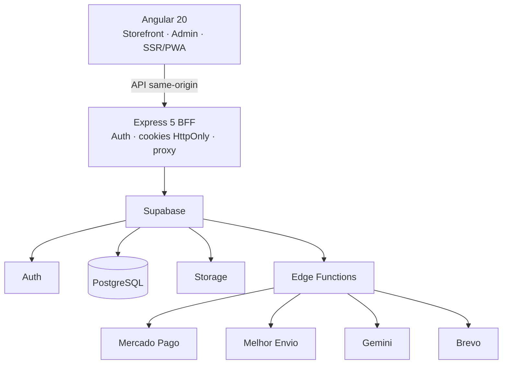
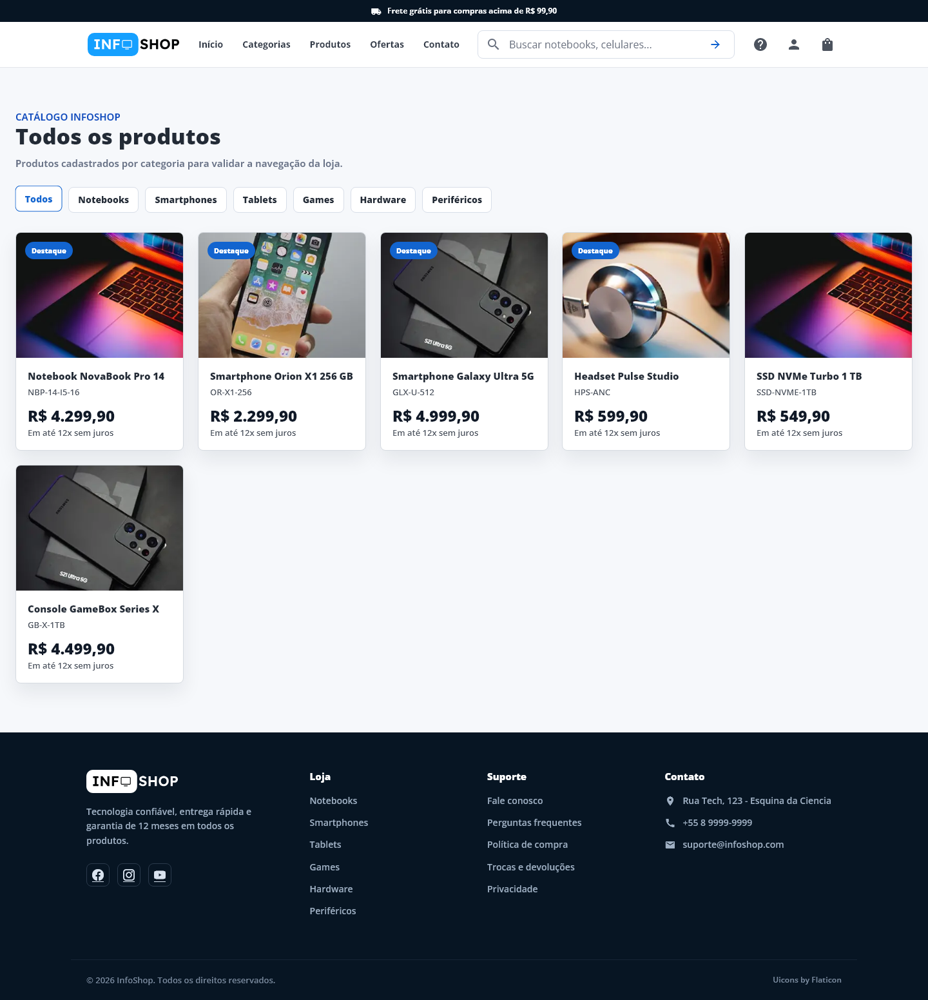
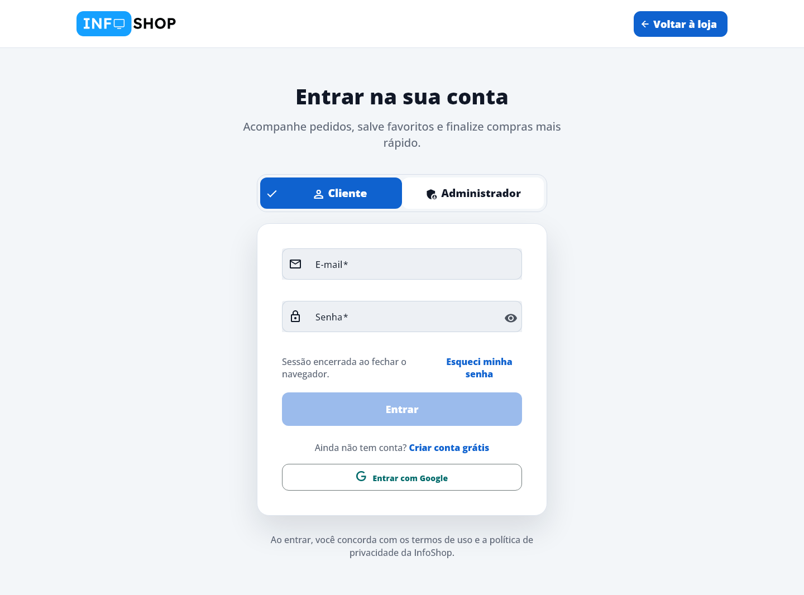
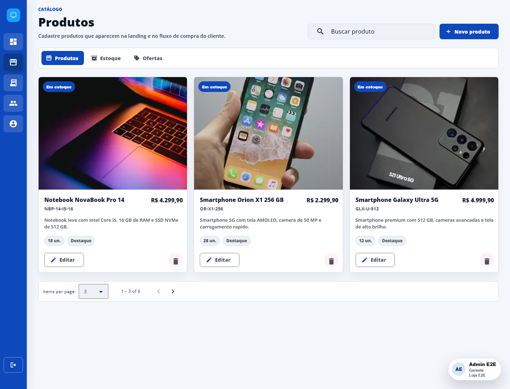

<div align="center">


# Info-Shop

**E-commerce full-stack para produtos de tecnologia com storefront, checkout, rastreamento de pedidos e painel administrativo.**

Angular · Supabase · Express · PostgreSQL

[Ver demo](https://infoshop.netlify.app/) · [Documentação](docs/index.md) · [Reportar problema](https://github.com/Gust4v0Di4sC/Info-Shop/issues)

</div>

---

<p align="center">
  
</p>

## Sobre

**Info-Shop** é uma plataforma de e-commerce que reúne a experiência de compra e a administração da loja em uma única aplicação.

O projeto permite explorar o catálogo, comprar e acompanhar entregas, além de gerenciar produtos, estoque, clientes e pedidos, com foco em **segurança, separação por domínio e uma experiência consistente entre loja e administração**.

## Destaques

- 🛒 **Loja e checkout** — catálogo, busca, carrinho e jornada de compra completa.
- 📦 **Pedidos e entregas** — acompanhamento do pedido até a entrega ao cliente.
- 📊 **Painel administrativo** — gestão de produtos, estoque, ofertas, clientes e pedidos.
- 💳 **Mercado Pago** — criação e acompanhamento de pagamentos.
- 🚚 **Melhor Envio** — cotação de frete, checkout logístico e webhooks.
- 🤖 **Comparação com IA** — assistente com Gemini para comparar hardware.

## Tecnologias

| Área | Tecnologias |
| --- | --- |
| Front-end | Angular 20, TypeScript, RxJS |
| UI | SCSS, Angular Material, Bootstrap, GSAP |
| Back-end | Express 5, Angular SSR, Netlify Functions |
| Banco e serviços | Supabase, PostgreSQL, Auth, Storage, Edge Functions |
| Integrações | Mercado Pago, Melhor Envio, Gemini, Brevo, Sentry |
| Testes | Jasmine, Karma, Playwright |
| Deploy | Netlify, Supabase |

## Arquitetura


```mermaid
flowchart TD
    Angular["Angular 20<br/>Storefront · Admin · SSR/PWA"]
    BFF["Express 5 BFF<br/>Auth · cookies HttpOnly · proxy"]
    Supabase["Supabase"]

    Angular -->|API same-origin| BFF
    BFF --> Supabase

    Supabase --> Auth["Auth"]
    Supabase --> Postgres[("PostgreSQL")]
    Supabase --> Storage["Storage"]
    Supabase --> Edge["Edge Functions"]

    Edge --> MercadoPago["Mercado Pago"]
    Edge --> MelhorEnvio["Melhor Envio"]
    Edge --> Gemini["Gemini"]
    Edge --> Brevo["Brevo"]
```

O Angular concentra as experiências pública e administrativa. O BFF Express mantém a sessão em cookies `HttpOnly`, expõe uma API same-origin e encaminha o acesso ao Supabase. As Edge Functions isolam credenciais e integrações externas.

> Veja os fluxos de catálogo, autenticação, administração e renderização em [docs/architecture.md](docs/architecture.md).

## Capturas do projeto

<details>
<summary>Ver landing page, catálogo, login e painel administrativo</summary>

### Landing page


### Catálogo



### Login



### Administração de produtos



</details>

## Executando localmente

Requisitos: Node.js `>= 24`, npm e um projeto Supabase configurado.

```bash
git clone https://github.com/Gust4v0Di4sC/Info-Shop.git
cd Info-Shop
npm install
npm run dev
```

A aplicação estará disponível em `http://127.0.0.1:4200`.

Crie `.env.development.local` com as variáveis públicas do ambiente:

```env
SUPABASE_URL=http://127.0.0.1:54321
SUPABASE_ANON_KEY=your-local-anon-public-key
PUBLIC_SITE_URL=http://127.0.0.1:4200
```

Consulte [.env.example](.env.example) e a [documentação de deploy](docs/deployment.md) para a configuração completa. Segredos como `SUPABASE_SERVICE_ROLE_KEY`, tokens de pagamento e chaves de IA não devem ser expostos no front-end.

## Documentação

- [Visão geral](docs/overview.md)
- [Arquitetura](docs/architecture.md)
- [Front-end Angular](docs/frontend.md)
- [Back-end e API](docs/backend-api.md)
- [Banco de dados](docs/database.md)
- [Integrações](docs/integrations.md)
- [Segurança](docs/security.md)
- [Testes](docs/testing.md)
- [Deploy e operação](docs/deployment.md)

## Licença

Este repositório ainda não possui uma licença definida.
