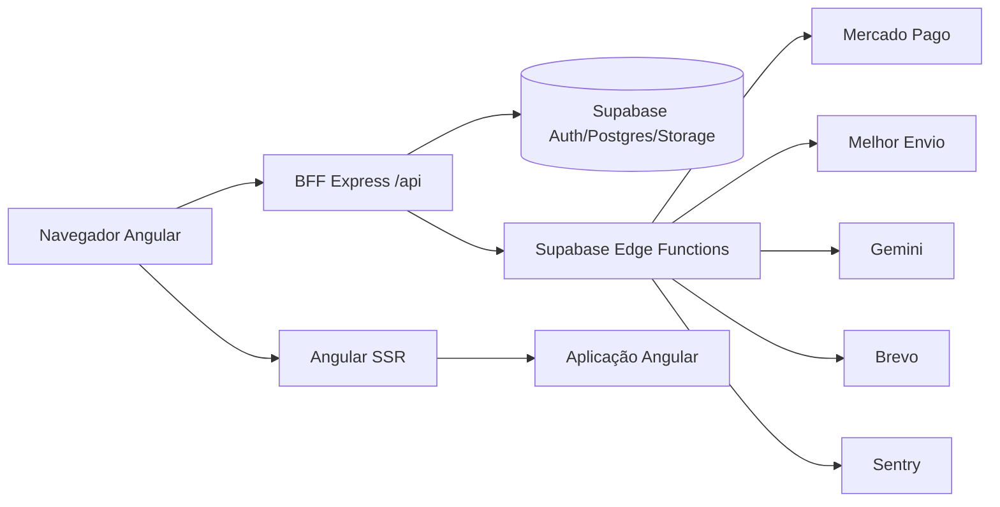

# Arquitetura

## Visão de Alto Nível

## Camadas

- UI: componentes standalone em `src/app/features`.
- Aplicação: serviços em `src/app/services`, com RxJS e chamadas HTTP/Supabase.
- Core: autenticação, guards, Supabase client, tenant, tema, layout e observabilidade.
- BFF: Express em `src/api-app.ts`, responsável por autenticação segura, headers, proxy e endpoints públicos.
- Dados: Supabase Postgres com migrations versionadas e tipos gerados em `database.types.ts`.
- Integrações: Supabase Edge Functions em Deno, separadas por provedor/fluxo.

## Fluxo Público de Catálogo

1. Angular chama `ProductService.getPublicCatalog()`.
2. O serviço usa `/api/public/products`.
3. O BFF valida e normaliza query params como `category`, `q`, `limit` e `featured`.
4. O BFF consulta `products` com a anon key e políticas RLS.
5. A resposta é cacheada com `public, max-age=60, s-maxage=300`.

## Fluxo Autenticado

1. Login/cadastro acontece por `/api/auth/*`.
2. O BFF usa `@supabase/ssr` e grava sessão em cookies HttpOnly.
3. O Angular mantém apenas estado derivado do usuário atual via `AuthService`.
4. Chamadas Supabase do browser são reescritas para `/api/supabase/*`.
5. O BFF injeta `Authorization: Bearer <access_token>` quando existe sessão.

## Fluxo Administrativo

1. `AuthGuard` exige usuário autenticado.
2. `AdminGuard` consulta `admins` ativo e valida `allowedRoles` configurado na rota.
3. `TenantContextService` carrega lojas de `admin_store_accesses`.
4. Serviços administrativos sempre filtram por `store_id`.
5. RLS reforça isolamento por loja no banco.

## Renderização

- `angular.json` usa `@angular/build:application` com `outputMode: server`.
- `src/main.ts` é a entrada browser.
- `src/main.server.ts` é a entrada SSR.
- `src/server.local.ts` roda Express local e serve assets do build.
- `src/server.ts` usa o runtime Angular da Netlify e encaminha `/api/*`.
